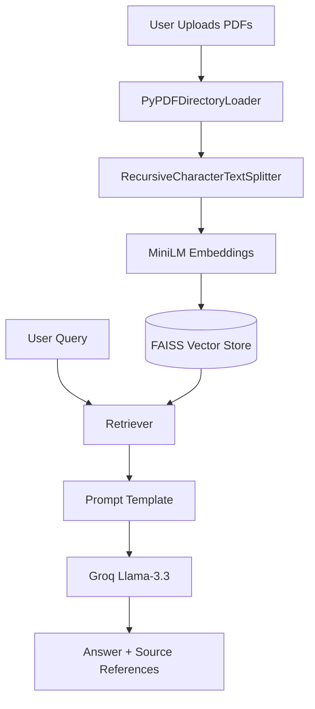

# Enterprise Knowledge Assistant

A Retrieval-Augmented Generation (RAG) application that enables users to query enterprise PDF documents using semantic search and an LLM.

---

## Features

* Upload enterprise PDF documents
* Automatic document chunking
* Embedding generation using MiniLM
* FAISS vector database
* Semantic retrieval
* Llama-3.3-70B via Groq
* Source citation
* Hallucination prevention

---

## Tech Stack

* Python
* Streamlit
* LangChain
* HuggingFace Embeddings
* FAISS
* Groq API
* Llama 3.3 70B

---

## Project Architecture



---

## Installation

```bash
git clone <repo>

cd enterprise-knowledge-assistant

pip install -r requirements.txt

streamlit run app.py
```

---

## Usages

1. Upload PDFs
2. Click
```text
    Process & Index Knowledge Base
```
3. Ask questions.

---

## Chunking Strategy

```text
Chunk Size : 750

Overlap : 100
```
### Reason
- preserves semantic context
- avoids sentence truncation
- improves retrieval quality
- minimizes embedding fragmentation

---

## Embedding Model
```text
sentence-transformers/all-MiniLM-L6-v2
```
### Reason
- Fast
- Lightweight
- High semantic similarity accuracy
- Suitable for CPU inference

---

## LLM
```text
Llama 3.3 70B Versatile (Groq)
```
### Reason
- Fast inference
- High reasoning capability
- Free API
- Excellent RAG performance

---

## Retrieval
```text
Top K = 4
```
### Reason
Balances
- relevance
- latency
- context window

---

## Prompt Engineering
The assistant is instructed to:
- answer only from retrieved context
- never hallucinate
- cite document sources
- refuse unsupported questions

---

## Known Limitations
- Only PDF documents supported
- No OCR for scanned PDFs
- Images, charts, and tables are not interpreted
- FAISS index stored locally
- No hybrid search (keyword + vector)
- No conversation memory
- Groq API key required

---

## Future Improvements
- OCR support
- Hybrid Retrieval
- Cross Encoder Reranker
- Multi-modal RAG
- Metadata Filtering
- Authentication
- Docker Deployment
- Cloud Vector Database