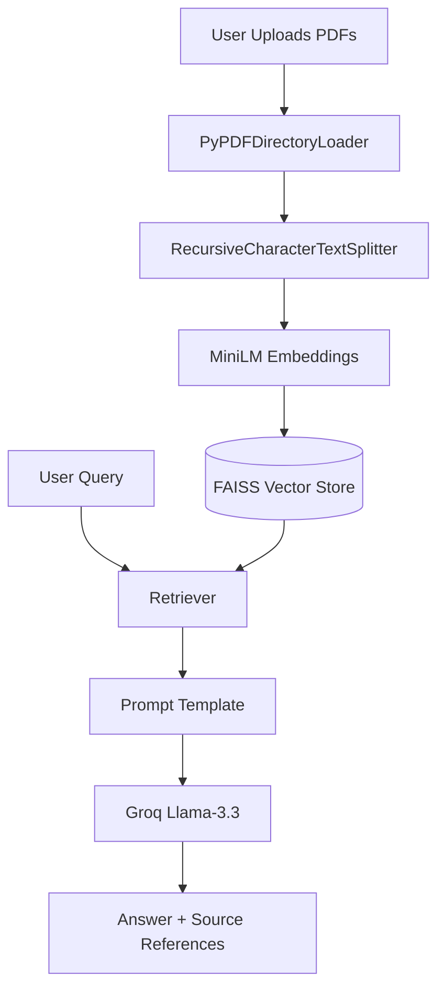

# Enterprise Knowledge Assistant

A Retrieval-Augmented Generation (RAG) application that enables users to query enterprise PDF documents using semantic search and an LLM.

---

## Features

* Upload enterprise PDF documents
* Automatic document chunking
* Embedding generation using MiniLM
* FAISS vector database
* Semantic retrieval
* Llama-3.3-70B via Groq
* Source citation
* Hallucination prevention

---

## Tech Stack

* Python
* Streamlit
* LangChain
* HuggingFace Embeddings
* FAISS
* Groq API
* Llama 3.3 70B

---

## Project Architecture


```mermaid
flowchart TD

A[User Uploads PDFs]
--> B[PyPDFDirectoryLoader]
--> C[RecursiveCharacterTextSplitter]
--> D[MiniLM Embeddings]
--> E[(FAISS Vector Store)]

F[User Query]
--> G[Retriever]

E --> G
G --> H[Prompt Template]
H --> I[Groq Llama-3.3]
I --> J[Answer + Source References]
```

---

## Installation

```bash
git clone https://github.com/deepugupta0820/enterprise-knowledge-assistant.git

cd enterprise-knowledge-assistant

pip install -r requirements.txt

streamlit run app.py
```

---

## Usages

1. Upload PDFs
2. Click
```text
    Process & Index Knowledge Base
```
3. Ask questions.

---

## Chunking Strategy

```text
Chunk Size : 750

Overlap : 100
```
### Reason
- preserves semantic context
- avoids sentence truncation
- improves retrieval quality
- minimizes embedding fragmentation

---

## Embedding Model
```text
sentence-transformers/all-MiniLM-L6-v2
```
### Reason
- Fast
- Lightweight
- High semantic similarity accuracy
- Suitable for CPU inference

---

## LLM
```text
Llama 3.3 70B Versatile (Groq)
```
### Reason
- Fast inference
- High reasoning capability
- Free API
- Excellent RAG performance

---

## Retrieval
```text
Top K = 4
```
### Reason
Balances
- relevance
- latency
- context window

---

## Prompt Engineering
The assistant is instructed to:
- answer only from retrieved context
- never hallucinate
- cite document sources
- refuse unsupported questions

---

## Retrieval Evaluation

The evaluation uses a labelled test set and three information-retrieval metrics:

- **Precision@K**: fraction of the top-K retrieved pages that are relevant.
- **Recall@K**: fraction of the labelled relevant pages found in the top-K results.
- **MRR (Mean Reciprocal Rank)**: rewards placing the first relevant result at a high rank.

### Evaluation files

```text
evaluation/
├── eval_dataset.json
└── evaluate_retrieval.py
```

`eval_dataset.json` contains test questions and their ground-truth relevant pages. `evaluate_retrieval.py` loads the **existing FAISS index** and calculates Precision@1/2/4, Recall@1/2/4 and MRR@1/2/4. It does not change the Streamlit UI.

### Run evaluation

First use the existing application normally to upload and index the PDFs. Then, from the project root, run:

```bash
python evaluation/evaluate_retrieval.py
```

For custom K values:

```bash
python evaluation/evaluate_retrieval.py --k 1 2 4
```

Detailed per-query results are written to:

```text
evaluation/evaluation_results.json
```

---

## Known Limitations
- Only PDF documents supported
- No OCR for scanned PDFs
- Images, charts, and tables are not interpreted
- FAISS index stored locally
- No hybrid search (keyword + vector)
- No conversation memory
- Groq API key required

---

## Future Improvements
- OCR support
- Hybrid Retrieval
- Cross Encoder Reranker
- Multi-modal RAG
- Metadata Filtering
- Authentication
- Docker Deployment
- Cloud Vector Database